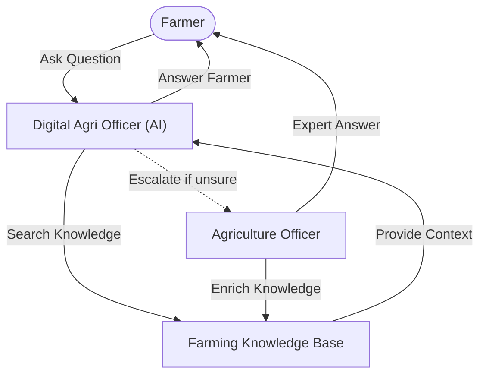
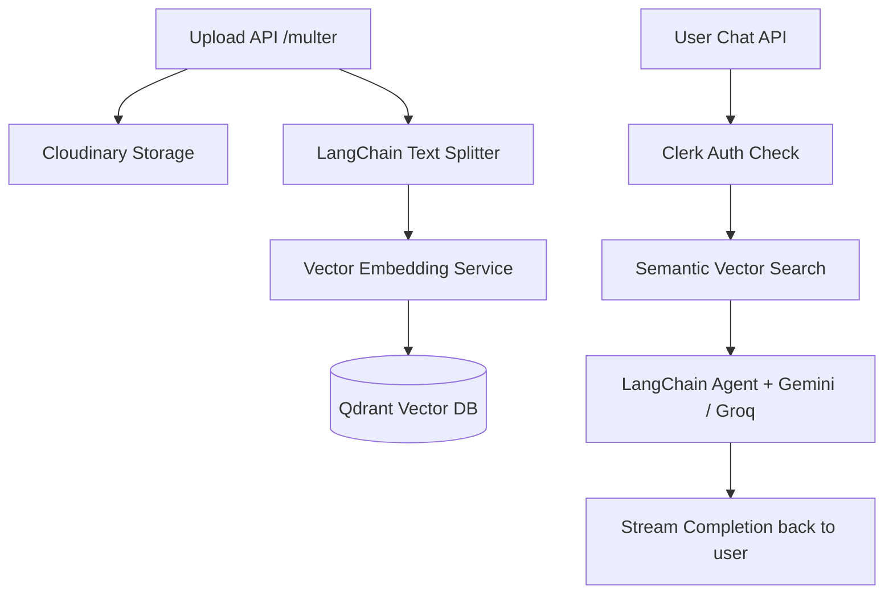

# Krishi Sahayak (Farmer Assistant) - Backend Server

This repository contains the backend server for **Krishi Sahayak v2**, an advanced, AI-powered agricultural ecosystem. The backend orchestrates RAG reasoning using **LangChain Agents**, handles document ingestion into **Qdrant**, manages user session data in **MongoDB**, and provides secure APIs for farmers and agricultural officers.

> 💻 **Looking for the frontend client?** Refer to the [Krishi Sahayak Frontend Client](https://github.com/sonu-shivcharan/krishi-sahayak-frontend-v2) repository.

---

## Table of Contents
1. [Core Features](#core-features)
2. [Tech Stack](#tech-stack)
3. [System Workflow](#system-workflow)
4. [Technical Architecture](#technical-architecture)
5. [Prerequisites](#prerequisites)
6. [Setup & Installation](#setup--installation)
7. [Environment Variables](#environment-variables)
8. [Available Scripts](#available-scripts)
9. [API Endpoints](#api-endpoints)

---

## Core Features

*   **RAG (Retrieval-Augmented Generation) Pipeline**: Parses expert-uploaded PDF manuals, generates text chunks, computes vector embeddings, and stores them in Qdrant for semantic search.
*   **AI Agent Orchestration**: Uses **LangChain Agents** to route, process, and construct structured agent decisions utilizing models from dynamic providers (**Google Gemini 2.5 Flash** as primary, or **Groq** models). The model provider can be switched by changing the `LLM_PROVIDER` environment variable.
*   **Human Escalation System**: Automatically saves context and manages the workflow when a farmer's question is escalated to an Agricultural Officer.
*   **Media & Document Management**: Integrated with **Multer** and **Cloudinary** for secure and scalable document storage.
*   **Secure API Access**: Uses `@clerk/express` for token verification and path protection.

---

## Tech Stack

*   **Runtime & Server**: Node.js, Express, TypeScript
*   **Databases**: MongoDB (Primary Database via Mongoose), Qdrant (Vector Database)
*   **AI Orchestration**: LangChain Agents
*   **LLMs Supported**: Google Gemini (Primary: `gemini-2.5-flash`), Groq models (e.g., Llama/Mistral)
*   **Authentication**: Clerk Express Middleware
*   **File Upload**: Multer, Cloudinary, pdf-parse
*   **Validation & Logging**: Zod, Winston, Morgan

---

## System Workflow

The application operates as an intelligent loop between the **Farmer**, the **AI Assistant**, the **Knowledge System**, and the **Human Help System**:



### Workflow Steps:
1. **Ask Farming Question**: The **Farmer** initiates a query via the application.
2. **Look for Related Information**: The **Digital Agri Officer (AI)** queries the **Farming Knowledge Base** for context.
3. **Useful Details**: Relevant context matches are returned to the AI Assistant.
4. **Resolve or Escalate**:
   * **Tier 1 (Auto-resolve)**: If the retrieved knowledge is clear and sufficient, the AI Assistant answers the farmer directly.
   * **Tier 2 (Escalate)**: If the AI is unsure or lacks sufficient confidence, it escalates the question along with all relevant context to nearby human **Agriculture Officers**, triggering a push notification to them via **Firebase Cloud Messaging (FCM)**.
5. **Expert Answer**: The **Agriculture Officer** reviews the context and sends an expert manual response directly to the farmer. Once answered, a push notification is sent back to the **Farmer** via **FCM** to notify them of the expert response.
6. **Enrich Knowledge Base**: The officer's expert response is added to the **Farming Knowledge Base** so that the AI can handle similar questions automatically in the future.

---

## Technical Architecture



---

## Prerequisites

Make sure you have installed:
*   [Node.js](https://nodejs.org/) (v18+) or [Bun](https://bun.sh/)
*   [MongoDB](https://www.mongodb.com/) (Local server or Atlas URL)
*   [Qdrant Vector DB](https://qdrant.tech/) account or instance

---

## Setup & Installation

1. Navigate to the repository root directory:
   ```bash
   cd backend
   ```

2. Install dependencies:
   ```bash
   bun install
   # or
   npm install
   ```

3. Create your `.env` file from the sample:
   ```bash
   cp env.sample .env
   ```

4. Configure the variables in `.env` (see below).

---

## Environment Variables

```env
# Google Gemini API
GOOGLE_GEMINI_API_KEY="your-gemini-api-key"
LLM_PROVIDER="google"

# MongoDB Database Configuration
MONGODB_URL="mongodb+srv://..."
DB_NAME="krishi-sahayak"

# Qdrant Vector DB Credentials
QDRANT_URL="https://your-qdrant-url"
QDRANT_API_KEY="your-qdrant-api-key"

# Clerk Security Credentials
CLERK_PUBLISHABLE_KEY="pk_test_..."
CLERK_SECRET_KEY="sk_test_..."

# Cloudinary Storage
CLOUDINARY_CLOUD_NAME="your-cloud-name"
CLOUDINARY_API_KEY="your-api-key"
CLOUDINARY_API_SECRET="your-api-secret"

# Cors and Firebase Configuration
CORS_ORIGIN="http://localhost:5173"
FIREBASE_SERVICE_ACCOUNT='{"type": "service_account", ...}'
```

---

## Available Scripts

*   **Start in Development Mode** (using nodemon and ts-node):
    ```bash
    bun run dev
    # or
    npm run dev
    ```
*   **Compile TypeScript**:
    ```bash
    bun run build
    # or
    npm run build
    ```
*   **Start Production Build**:
    ```bash
    bun run start
    # or
    npm run start
    ```

---

## API Endpoints

### 1. User Management (`/api/v1/users`)
*   `POST /register`: Registers a new farmer or officer profile (requires Clerk signature).
*   `GET /me`: Fetch the active user's profile detail.
*   `PATCH /me`: Update details for the current user profile.

### 2. Chat & AI Streams (`/api/v1/conversations`)
*   `GET /`: List all conversations of the authenticated user.
*   `POST /start`: Initiate a new conversation thread.
*   `POST /:conversationId`: Send a message and stream the AI's response contextually using RAG.
*   `GET /:conversationId`: Retrieve message history for a specific chat.

### 3. Escalations (`/api/v1/forwarded-queries`)
*   `POST /forward`: Escalate a specific chat context to nearby agricultural officers.
*   `GET /me`: List all queries escalated by the logged-in farmer.
*   `GET /`: Retrieve all queries forwarded to the logged-in officer (requires Officer Role).
*   `PATCH /:forwardedQueryId/answer`: Resolve/answer a forwarded query (requires Officer Role).
